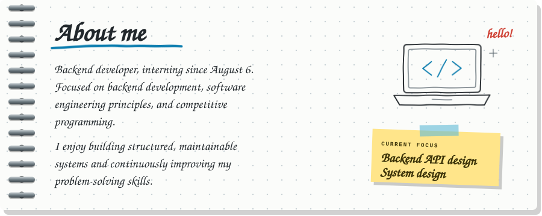
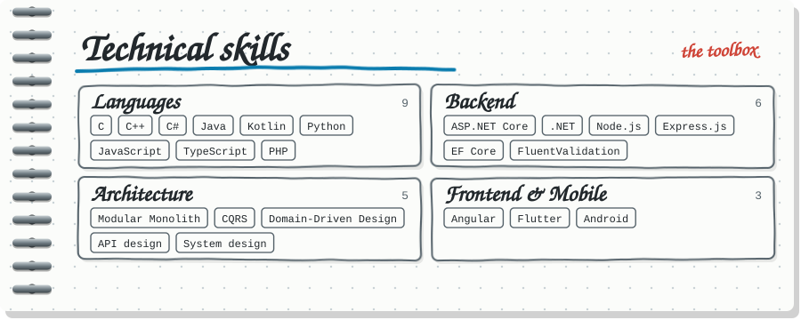
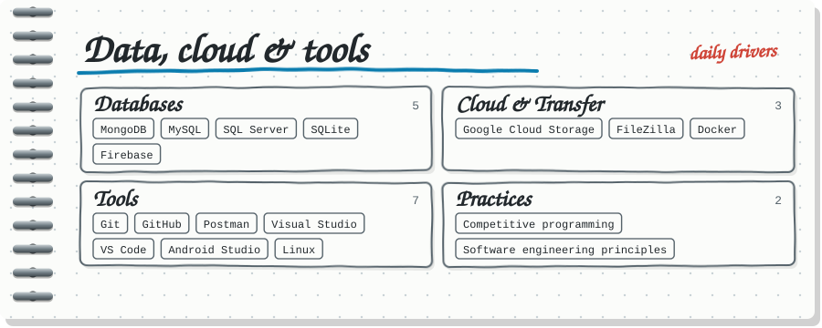
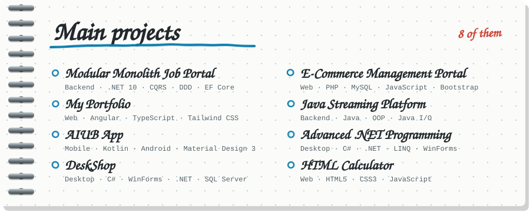
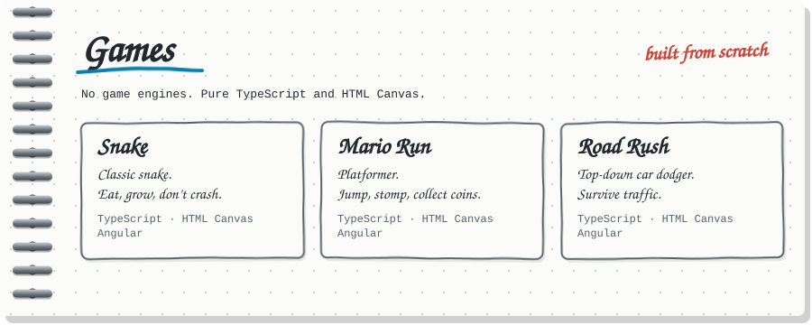
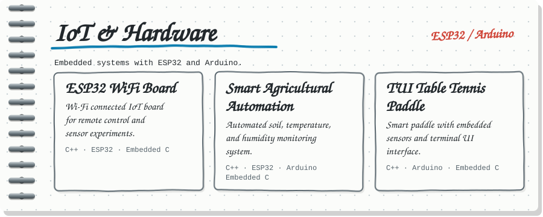
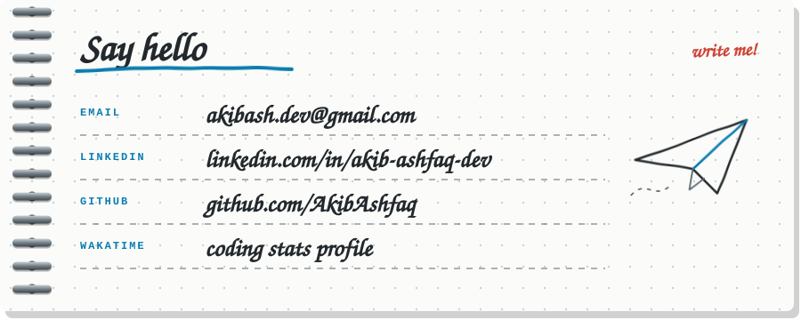

 

Click a button to open that page right here.

 

 

 

 

 

[My Portfolio](https://github.com/AkibAshfaq/My_Portfolio) ·
[AIUB App](https://github.com/AkibAshfaq/AIUB-App) ·
[DeskShop](https://github.com/AkibAshfaq/DeskShop) ·
[E-Commerce Portal](https://github.com/AkibAshfaq/E-Commarce-Managment-Accountant-Portal) ·
[Java Streaming](https://github.com/AkibAshfaq/JAVA-STREAMING-PLATFORM) ·
[Advanced .NET](https://github.com/AkibAshfaq/Advanced-Programming-in-.NET) ·
[Calculator demo](https://akibashfaq.github.io/HTML-Calculator-With-JS/) ·
[Calculator repo](https://github.com/AkibAshfaq/HTML-Calculator-With-JS)

 

 

[Play the games](https://my-portfolio-brown-pi-38.vercel.app/games)

 

 

[ESP32 WiFi Board](https://github.com/AkibAshfaq/Esp32-WIFI-Board) ·
[Smart Agricultural Automation](https://github.com/AkibAshfaq/SMART-AGRICULTURAL-AUTOMATION-SYSTEM) ·
[TUI Table Tennis Paddle](https://github.com/AkibAshfaq/TUI-Based-Table-Tennis-Paddle)

 

 

[Email](mailto:akibash.dev@gmail.com) ·
[LinkedIn](https://www.linkedin.com/in/akib-ashfaq-dev) ·
[GitHub](https://github.com/AkibAshfaq) ·
[WakaTime](https://wakatime.com/@1e5a6c61-a59c-4832-9015-d72c385f4c05)

 

